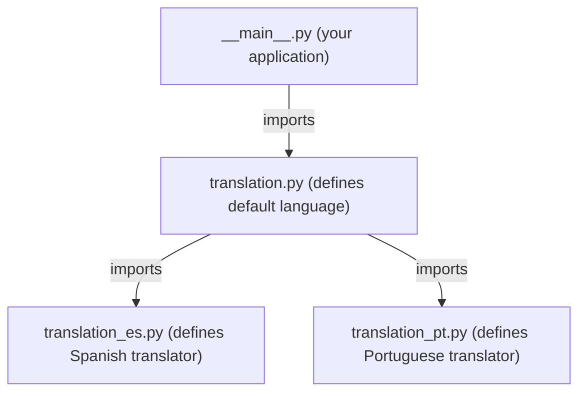
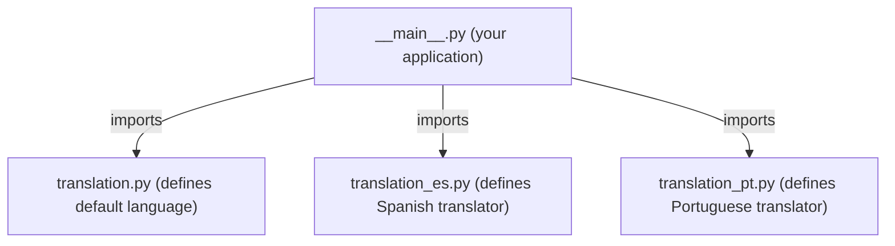

# Minimal string translation library for Python

In summary:

- Developers reference translatable strings using identifiers in an enumeration class.
- Language-specific strings are written in several enumeration classes.
- The library transparently transforms string identifiers into already translated strings,
  depending on the system locale or user-selected locale.

This is neither a full internationalization library nor suitable for usual translation workflows.
Make sure it meets your needs.
If not, there are other libraries that do the job, for example,
[gettext](https://docs.python.org/3/library/gettext.html).

## How to use

### Translate text for each locale

Define all translatable strings in an enumeration class.
Those enumerations are called **translators** in the context of this library.
Additionally:

- You **must** also define a `_lang` attribute and set its value
  to the corresponding locale or language string.
  A list of valid locale strings can be found at
  [saimana.com](https://saimana.com/list-of-country-locale-code/).
- You **should** also define a `_domain` attribute and set its value
  to your application's name or any other random string. This prevents any conflict
  with translators from other libraries (if any). If not given, current
  module name is used, so you must create all your translators in the same module
  in that case.

For example:

```python
from enum import Enum

class EN(Enum):
    _lang = "en"
    _domain = "appstrings.example"
    TEST = "Hello world!"

class ES_MX(Enum):
    _lang = "es_MX"
    _domain = "appstrings.example"
    TEST = "¡Hola mundo!"
```

Then, all translators must be "installed" at initialization:

```python
from appstrings import install

install(EN)
install(ES_MX)
```

The library will check that all installed translators enumerate the same set of constants,
except for "sunder" and "dunder" ones.
Use that notation for non-translatable attributes if you need to. For example:

```python
class ES_MX(Enum):
    _lang = "es_MX"
    _domain = "appstrings.example"
    _note = "this is a developer note, not to be translated"
    TEST = "¡Hola mundo!"
```

Note that another library imported in your project may use *appstrings* as well, thus installing its own translators.
Use the *_domain* attribute to prevent any conflict.

### Use already translated text

The function `gettext()` is used for translation. For example:

```python
from appstrings import gettext

print(gettext(EN.TEST))
```

You may want to alias `gettext` to `_` for convenience:

```python
_ = gettext

print(_(EN.TEST)) # Print translated string, depending on current locale
```

This way, you may disable translation at any time for development purposes:

```python
# _ = gettext

_ = lambda id: id._value_

print(_(EN.TEST)) # Always print all strings in english, for now
```

The library chooses the best-matching translator for the current translation locale, which is initialized from `_locale._getdefaultlocale()`.
You may force a specific locale for translation at any time:

```python
from appstrings import set_translation_locale

set_translation_locale("es_MX")
print(_(EN.TEST)) # Prints text in Spanish language of Mexico
```

then force the system locale again:

```python
set_translation_locale()
```

Note that forcing a specific locale not available in your application will not *magically* translate your strings to that locale.

### Fallback to a default language

In the previous examples, there is no translator for the locale *pt_BR*, to say one.
In such a case, the translator used in `gettext()` will work as the **default language** for non-translated locales.
In the early example, Brazilian people would read the text in english.
However, if `print(_(ES_MX.TEST))` were used instead, Brazilian people would read the text in Spanish.

The ability to change the default language at any time comes from aliases:

```python
STR = EN

print(_(STR.TEST)) # Prints TEST string in english if there is no matching translator

STR = ES_MX

print(_(STR.TEST)) # Prints TEST string in Spanish if there is no matching translator
```

This approach is developer-friendly, but not user-friendly.

### Be user-friendly

Your application should allow the user to choose an available language
via command-line parameters, environment variables or other means.

The function `get_installed_translators()` will help in order to show a list of
available languages:

```python
print("Available languages/locales:")
for translator in get_installed_translators(STR._domain._value_):
    print(translator._lang._value_)
```

Obviously, you already know which languages are available in your application,
but this approach ensures you don't have to modify your code after adding a new translator.

Call `set_translation_locale()` to make effective the user preference.

### Organize your code for translation

You may spread your translators along many source files as long as your application imports and installs them.

For example:



But the following schema will work just the same:



The "translation*.py" files would look like this:

```python
from enum import Enum
from appstrings import install

class CertainTranslator(Enum):
    _lang = ...
    _domain = ...
    TEXT1 = ...
    TEXT2 = ...
    ...

install(CertainTranslator)
```

That is all about this library. As simple as that.

### Troubleshooting

- Why some strings are properly translated, but not others?

  Ensure all your translators have a *_domain* attribute set to the very same value (case-sensitive).

- I get a TranslatorException : *String ID XXX from YYYY is missing at ZZZZ*. Why ?

  There are two possible reasons:
  - One of your translators is missing a string that others have. Check.
  - Your application is in conflict with some library. User another string in the "_domain" attribute.
